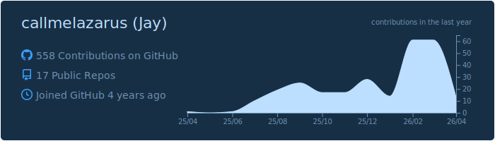

```
git log --oneline
> a3f9c12 init: added 'callmelazarus' to the world
> b7e2d45 feat: switched from structural to software engineering
> d4e7a11 feat: leveling up in TypeScript and system design
> c1d8f90 fix: still debugging life
```





<!---
callmelazarus/callmelazarus is a ✨ special ✨ repository because its `README.md` (this file) appears on your GitHub profile.
You can click the Preview link to take a look at your changes.
--->
